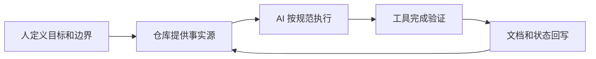
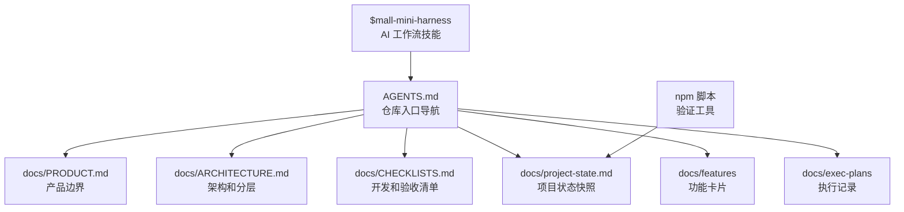
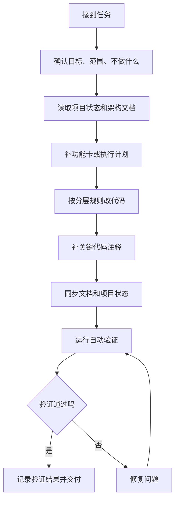
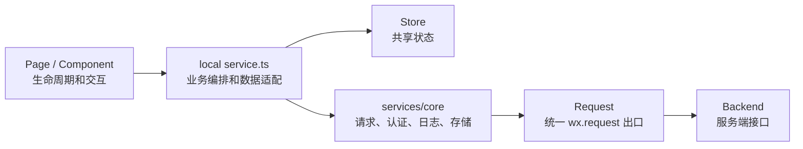
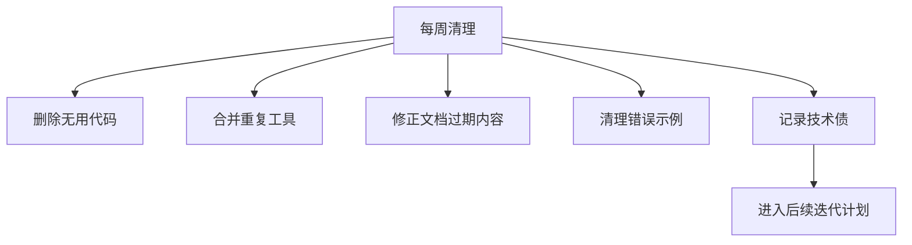
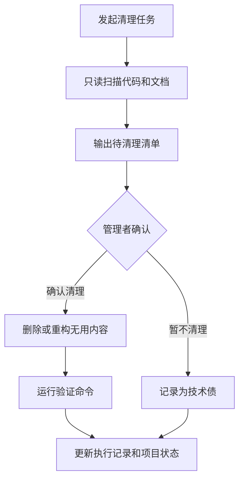
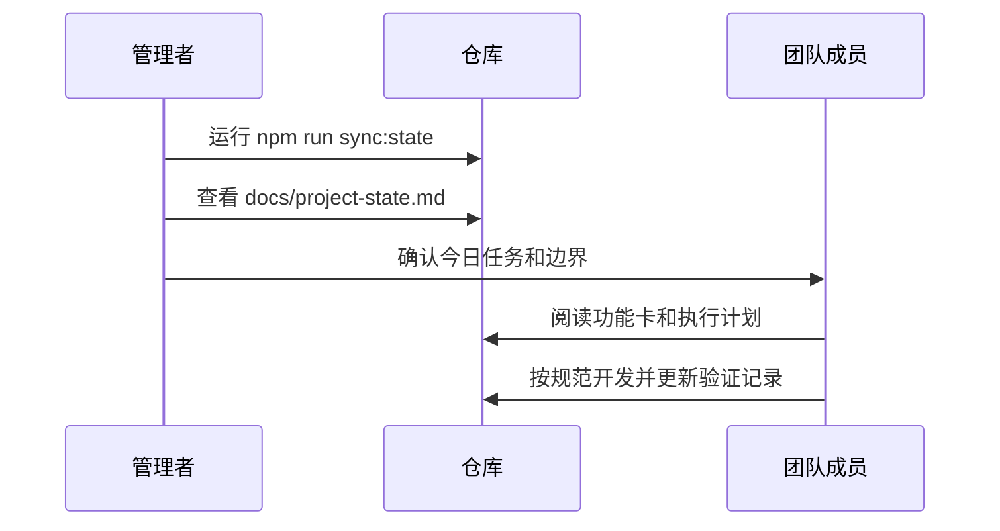
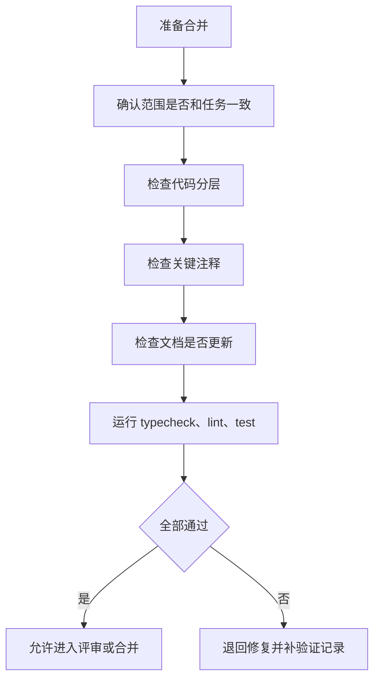
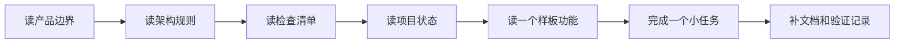

# Harness Engineering 团队落地手册

> 面向 `mall-mini` 项目的团队交接文档。本文说明本项目如何规划和使用 Harness Engineering，新成员如何快速上手，团队管理者如何维护项目状态、清理无用信息并对齐进度。

## 1. 一句话说明

本项目的 Harness Engineering 不是单纯“让 AI 写代码”，而是把需求、架构、规范、工具、验证和项目状态都沉淀到仓库里，让团队成员和 AI 都能围绕同一套事实源稳定工作。



## 2. 我们为什么需要这套系统

传统多人协作加 AI 开发容易出现这些问题：

| 问题           | 典型表现                                      | 本项目的解决方式                                                                    |
| -------------- | --------------------------------------------- | ----------------------------------------------------------------------------------- |
| 需求边界不清   | AI 顺手做了范围外功能                         | 先写 `docs/features/*` 或 `docs/exec-plans/*`，明确做什么和不做什么                 |
| 项目规则丢失   | 新会话不知道分层规范                          | 用 `AGENTS.md`、`ARCHITECTURE.md`、`CHECKLISTS.md` 和 `$mall-mini-harness` 固化规则 |
| 代码越改越乱   | 业务逻辑散落到页面、全局 service 和全局 types | 规定页面和组件就近维护 `service.ts`，业务类型就近维护                               |
| 只改代码不验证 | 功能看起来完成，但编译或小程序校验失败        | 固定执行 `sync:state`、`typecheck`、`lint`、`test`                                  |
| 文档落后代码   | 团队对当前状态理解不一致                      | 变更行为、约束或模块时同步更新文档和 `project-state`                                |
| AI 复制坏模式  | 旧代码中的坏样例被反复放大                    | 定期清理无用代码、过期文档和错误示例                                                |

## 3. 当前系统由哪些部分组成



核心文件职责如下：

| 文件或目录              | 用途                           | 什么时候读                     |
| ----------------------- | ------------------------------ | ------------------------------ |
| `AGENTS.md`             | AI 和团队成员的入口导航        | 每次新会话或新成员入场先读     |
| `docs/PRODUCT.md`       | 产品目标、业务边界、角色定义   | 判断需求是否越界时读           |
| `docs/ARCHITECTURE.md`  | 分层规则、依赖方向、目录职责   | 写代码前必须读                 |
| `docs/CHECKLISTS.md`    | 开发、冒烟、Agent 执行清单     | 开发中和合并前必须读           |
| `docs/project-state.md` | 当前模块、状态、工作树快照     | 每天开工和跨模块改动后读       |
| `docs/features/*`       | 单个功能的目标、范围、验收标准 | 做具体功能前读或新增           |
| `docs/exec-plans/*`     | 复杂任务的计划、验证记录、结论 | 复杂任务开始前建，结束后补记录 |
| `$mall-mini-harness`    | 让 AI 自动执行项目工作流       | 给 AI 下任务时显式调用         |

## 4. 标准开发闭环

每个真实开发任务都应走下面这条闭环。



对应命令如下：

```bash
npm run sync:state
npm run typecheck
npm run lint
npm run test
```

如果只改文档，也至少执行：

```bash
npm run sync:state
npm run lint
```

## 5. 新成员如何快速上手

### 第一天先做这些事

1. 阅读 `AGENTS.md`，知道项目入口和工作规则。
2. 阅读 `docs/PRODUCT.md`，理解产品目标和业务边界。
3. 阅读 `docs/ARCHITECTURE.md`，理解页面、组件、local service、store、core service 和 types 的分工。
4. 阅读 `docs/CHECKLISTS.md`，理解编码前、实现中、合并前要检查什么。
5. 阅读 `docs/project-state.md`，了解当前模块、分支、包管理器和知识库索引。
6. 在本地执行 `npm run typecheck`、`npm run lint`、`npm run test`，确认环境可用。

### 第一个功能按这个顺序做

1. 找到或新建 `docs/features/<feature>.md`。
2. 如果任务复杂，新建 `docs/exec-plans/<task>.md`。
3. 只修改自己负责模块的文件。
4. 页面或组件目录下必须有自己的 `service.ts` 承载业务编排。
5. 业务类型优先写在页面、组件、store 或 local service 中，不要随意放到 `miniprogram/types`。
6. 页面和组件不要直接调用 `wx.request`。
7. 关键代码必须写注释，尤其是接口字段含义、页面 state 含义、数据转换、复杂分支和脚本逻辑。
8. 完成后运行验证命令，并把结果写回功能卡或执行记录。

## 6. 开发者必须遵循的代码规范



必须遵循：

| 规则     | 正确做法                              | 禁止做法                      |
| -------- | ------------------------------------- | ----------------------------- |
| 请求入口 | 统一经过 `services/core/request.ts`   | 页面或组件直接写 `wx.request` |
| 业务编排 | 放在当前页面或组件目录的 `service.ts` | 全部塞进页面 `index.ts`       |
| 业务类型 | 就近定义在所属模块                    | 统一堆到 `miniprogram/types`  |
| 全局状态 | 只放跨页面共享状态                    | 把页面私有状态塞进 store      |
| 后端 DTO | local service 转成 ViewModel          | 页面直接渲染 DTO              |
| 注释     | 解释字段含义、边界和意图              | 只写“设置变量”这类无效注释    |
| 文档     | 行为变更同步更新                      | 只改代码不改说明              |

推荐页面结构：

```text
miniprogram/pkg-xxx/pages/<page-name>/
  index.ts
  index.wxml
  index.scss
  index.json
  service.ts
```

## 7. 如何和 AI 协作

给 AI 下任务时不要只说“帮我做一下这个页面”。推荐统一显式调用 `$mall-mini-harness`。

最短模板：

```md
使用 $mall-mini-harness，完成 <模块/页面> 的 <任务>，只改 <范围>，不做 <范围外内容>，完成后同步文档、项目状态并执行验证。
```

真实例子：

```md
使用 $mall-mini-harness，完成 <业务分包页面> 的 <具体功能>，只改该页面目录和必要公共能力，不接未确认接口，完成后同步文档、项目状态并执行验证。
```

```md
使用 $mall-mini-harness，修复 <业务页面> 的 <问题描述>，只改该页面目录和必要共享状态，不改未确认接口，完成后写明验证结果和残余风险。
```

AI 交付必须包含：

| 必须交付 | 说明                                          |
| -------- | --------------------------------------------- |
| 改动文件 | 让团队知道影响范围                            |
| 验证结果 | 至少说明 `typecheck`、`lint`、`test` 是否通过 |
| 文档更新 | 行为或约束变化必须写回仓库                    |
| 剩余风险 | 未做的手动验证、后端依赖、产品待确认点        |

如果 AI 没有做到上面四项，不要直接接受结果，应要求它继续补齐。

## 8. 团队管理者如何使用这套系统

### 每天什么时候更新项目状态

建议在这些时间点运行：

```bash
npm run sync:state
```

| 时间点                     | 目的                                 |
| -------------------------- | ------------------------------------ |
| 每天开工前                 | 让团队看到最新分支、模块和知识库索引 |
| 每个成员完成跨模块改动后   | 避免多人对项目状态理解不一致         |
| 每次新增功能卡或执行计划后 | 让状态快照包含新的知识入口           |
| 每次合并前                 | 让评审者看到最新工作树和模块状态     |
| 每次交接前                 | 给接手人一份最新地图                 |

### 什么时候清理无用信息

建议管理者每周至少安排一次轻量清理。

先明确边界：`npm run sync:state` 只负责刷新项目状态快照，不会自动判断或删除无用代码。真正的代码清理需要单独发起“代码清理任务”，并且必须经过检查、确认、执行、验证和记录。



需要清理的典型信号：

| 信号                 | 处理方式                                    |
| -------------------- | ------------------------------------------- |
| 文档描述和代码不一致 | 以当前代码为准修正文档，或暂停确认真实意图  |
| 某个模式被复制多次   | 抽成公共工具或写入规范                      |
| 临时 mock 已不再使用 | 删除或移动到明确的测试/示例位置             |
| 旧执行计划已经完成   | 保留结论，删除无意义过程噪音                |
| AI 多次犯同类错误    | 把正确规则写入 `CHECKLISTS.md` 或对应功能卡 |

### 代码清理任务的具体步骤

代码清理任务分成两段：第一段只读检查，不直接删除；第二段在清单确认后再执行清理。



第一步：发起只读检查。

```md
使用 $mall-mini-harness，检查当前仓库是否存在无用代码、过期 mock、重复工具、过时文档、错误示例和不符合分层规范的实现。只输出清理建议，不要修改或删除任何文件。

检查范围：

1. `miniprogram/pages`
2. `miniprogram/pkg-*`
3. `miniprogram/components`
4. `miniprogram/stores`
5. `miniprogram/services/core`
6. `miniprogram/types`
7. `docs/features`
8. `docs/exec-plans`

输出要求：

1. 按风险从高到低列出问题。
2. 每一项说明文件路径、问题原因、建议处理方式。
3. 标记“可直接删除”“需要合并”“需要人工确认”“建议暂缓”。
4. 不做任何文件修改。
```

第二步：管理者确认清理清单。

| 分类         | 管理者动作                                      |
| ------------ | ----------------------------------------------- |
| 可直接删除   | 确认没有被 `app.json`、路由、组件引用或文档依赖 |
| 需要合并     | 指定保留哪个实现，合并后删除重复实现            |
| 需要人工确认 | 找产品、后端或模块负责人确认业务含义            |
| 建议暂缓     | 记录到执行计划或技术债，不在本次删除            |

第三步：执行清理。

```md
使用 $mall-mini-harness，根据已确认的清理清单执行代码清理。

范围：
只处理以下已确认条目：
<粘贴确认后的清理清单>

要求：

1. 不处理未确认条目。
2. 删除代码前先确认引用关系。
3. 如果删除会影响路由、分包、组件注册或文档索引，同步更新对应配置。
4. 清理后更新相关 `docs/features/*` 或 `docs/exec-plans/*`。
5. 完成后运行 `npm run sync:state`、`npm run typecheck`、`npm run lint`、`npm run test`。
6. 最终说明删除了什么、保留了什么、验证结果和剩余风险。
```

第四步：验证和回写。

| 验证项           | 命令或动作                              |
| ---------------- | --------------------------------------- |
| 刷新状态         | `npm run sync:state`                    |
| 类型检查         | `npm run typecheck`                     |
| 代码和小程序校验 | `npm run lint`                          |
| 单元测试         | `npm run test`                          |
| 手动冒烟         | 微信开发者工具重新编译并检查关键页面    |
| 文档回写         | 在对应 `docs/exec-plans/*` 记录清理结果 |

第五步：交付清理结论。

```md
清理结论：

1. 已删除：
2. 已合并：
3. 已保留：
4. 已记录为技术债：
5. 验证结果：
6. 剩余风险：
```

清理时不要做这些事：

| 禁止事项                   | 原因                           |
| -------------------------- | ------------------------------ |
| 未确认直接删除业务代码     | 可能删除仍有业务价值的入口     |
| 把清理和新功能开发混在一起 | 容易扩大影响范围，评审困难     |
| 只删代码不改文档           | 后续 AI 和新人会继续读到旧事实 |
| 清理后不跑验证             | 容易漏掉路由、分包或类型错误   |
| 一次性清理全仓库           | 风险过高，应按模块分批处理     |

### 什么时候对齐项目进度

建议用固定节奏对齐，而不是等出问题再补救。

| 节奏       | 管理动作                                     | 产出                     |
| ---------- | -------------------------------------------- | ------------------------ |
| 每日       | 查看 `project-state` 和当前任务进度          | 今日风险和阻塞点         |
| 每周       | 清理坏样例、补齐文档、回顾验证失败原因       | 更新后的规范和技术债列表 |
| 每个里程碑 | 对照 `features` 和 `exec-plans` 核查完成情况 | 可交付范围和未完成范围   |
| 每次合并前 | 检查验证结果、影响范围、文档更新             | 可评审的变更说明         |

## 9. 管理者推荐操作步骤

### 每日开工流程



操作清单：

1. 运行 `npm run sync:state`。
2. 查看 `docs/project-state.md` 的工作树、模块列表和知识库索引。
3. 确认每个成员今天负责的模块。
4. 确认每个任务是否已有 `features` 或 `exec-plans`。
5. 对涉及权限、隐私、支付或不可逆操作的任务先人工确认。

### 每周清理流程

1. 搜索近期新增的功能卡和执行记录。
2. 查看是否有过期 TODO、废弃 mock、重复工具函数。
3. 检查 `miniprogram/types` 是否混入了业务专属类型。
4. 检查是否出现页面直接请求、页面直接渲染 DTO、全局 service 堆业务逻辑。
5. 把新发现的规则补到 `docs/CHECKLISTS.md` 或对应功能卡。
6. 运行 `npm run sync:state` 和 `npm run lint`。

### 合并前检查流程



合并前必须确认：

1. 代码只改了本次任务相关文件。
2. 页面和组件没有直接调用 `wx.request`。
3. 业务类型没有被随意放入全局 `types`。
4. 关键代码已有必要注释。
5. 功能卡或执行记录写明了验证结果。
6. `npm run typecheck`、`npm run lint`、`npm run test` 通过。

## 10. 推荐交接路径

给新成员交接时，建议按下面顺序走。



推荐交接材料：

| 顺序 | 文档                                        | 目的                                 |
| ---- | ------------------------------------------- | ------------------------------------ |
| 1    | `docs/PRODUCT.md`                           | 明确项目做什么，不做什么             |
| 2    | `docs/ARCHITECTURE.md`                      | 理解代码应该放在哪里                 |
| 3    | `docs/CHECKLISTS.md`                        | 理解交付和验收要求                   |
| 4    | `docs/project-state.md`                     | 了解当前项目状态                     |
| 5    | 当前任务对应的 `docs/features/<feature>.md` | 看功能卡如何描述目标、范围和验收标准 |
| 6    | 当前任务对应的 `docs/exec-plans/<task>.md`  | 看执行记录如何沉淀验证结果和风险     |
| 7    | 任一页面或组件目录下的 `service.ts`         | 看业务编排和类型如何就近维护         |

## 11. 常用命令

| 命令                     | 作用                             | 使用时机                        |
| ------------------------ | -------------------------------- | ------------------------------- |
| `npm install`            | 安装依赖                         | 首次拉取项目或依赖变更后        |
| `npm run build:mini-npm` | 构建小程序 npm 依赖              | 依赖变化或开发者工具构建 npm 前 |
| `npm run sync:state`     | 刷新项目状态快照                 | 每天开工、跨模块改动后、交接前  |
| `npm run typecheck`      | TypeScript 类型检查              | 开发中和合并前                  |
| `npm run lint`           | 代码风格、小程序配置和运行时校验 | 合并前必须执行                  |
| `npm run test`           | 单元测试入口                     | 合并前必须执行                  |

## 12. 什么时候必须人工接管

下面情况不要完全交给 AI 自动推进：

| 场景                       | 原因                                     |
| -------------------------- | ---------------------------------------- |
| 涉及支付、结算、资金流     | 影响高，必须人工确认                     |
| 涉及隐私、权限、角色可见性 | 容易造成合规或安全风险                   |
| 涉及不可逆操作             | 需要先确认回滚方案                       |
| 需求和仓库文档冲突         | 必须先对齐事实源                         |
| 同一问题连续修复失败       | 需要人工重新判断方向                     |
| 需要接生产后端             | 必须确认接口协议、鉴权、错误码和灰度策略 |

## 13. 最小可执行模板

新任务可以直接复制下面模板。

```md
使用 $mall-mini-harness，完成 <模块/页面> 的 <任务>。

范围：
只改 <文件或模块范围>。
不做 <明确不做的内容>。

要求：

1. 先读 `docs/project-state.md`、`docs/ARCHITECTURE.md`、`docs/CHECKLISTS.md`。
2. 如果没有功能卡，先补 `docs/features/<feature>.md`。
3. 复杂任务先补 `docs/exec-plans/<task>.md`。
4. 业务编排放到页面或组件目录下的 `service.ts`。
5. 业务类型就近维护，不要放到全局 `types`。
6. 关键代码必须写注释。
7. 完成后运行 `npm run sync:state`、`npm run typecheck`、`npm run lint`、`npm run test`。

交付：
说明改动文件、验证结果、文档更新和剩余风险。
```

## 14. 管理者检查模板

```md
本周 Harness 检查：

1. `docs/project-state.md` 是否是最新？
2. 新增功能是否都有 `docs/features/*`？
3. 复杂任务是否都有 `docs/exec-plans/*`？
4. 页面和组件是否仍然遵守 local `service.ts` 规则？
5. 是否有业务类型误放到全局 `types`？
6. 是否有页面直接调用 `wx.request`？
7. 是否有过期 mock、无用代码或重复工具？
8. 验证失败的问题是否已经写入执行记录？
9. 新发现的团队规则是否已经写入文档？
```

## 15. 最终原则

这套系统的核心不是追求文档很多，而是让每一次开发都可追踪、可验证、可交接。

团队只需要坚持三件事：

1. 事实写进仓库，不只留在聊天里。
2. 代码按分层放，不让坏模式扩散。
3. 每次交付都验证，并把结果写回项目状态。
